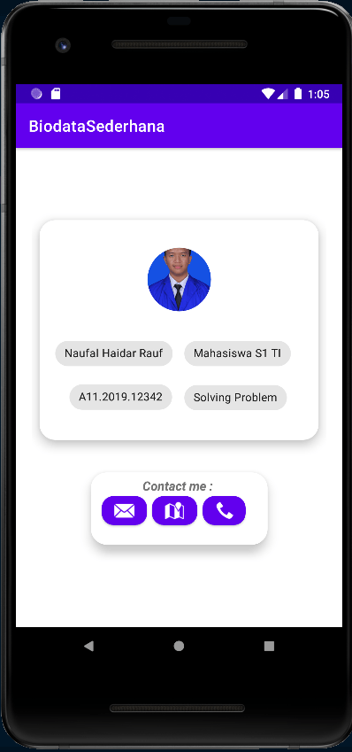

# Biodata Sederhana

- [Fitur](#feature)
- [Spesifikasi](#specs)
  - [dependencies](#dependencies)
- [Demo](#app-demo)
  - [Catatan](#small-notes)

<div id="feature">

## Fitur

- photo yang berbentuk lingkaran (CircularImageView)
  > Komponen ini dibuat oleh Mr. Lopez Mikhail. Kunjungi [repository](https://github.com/lopspower/CircularImageView) beliau untuk memahami penggunaan komponen tersebut.
- deskripsi pembuat aplikasi dengan menggunakan chip
- Kontak pembuat aplikasi yang diwakili oleh 3 tombol di bagian _Contact me_

<div id="specs">

## Spesifikasi

- Android Studio
  1. _Android Studio Arctic Fox_
  2. _Android Image R API Level 30_
- Dependencies

```gradle
dependencies {

    implementation 'androidx.appcompat:appcompat:1.3.1'
    implementation 'com.google.android.material:material:1.4.0'
    implementation 'androidx.constraintlayout:constraintlayout:2.1.0'
    testImplementation 'junit:junit:4.13.2'
    androidTestImplementation 'androidx.test.ext:junit:1.1.3'
    androidTestImplementation 'androidx.test.espresso:espresso-core:3.4.0'
    implementation "androidx.cardview:cardview:1.0.0"
    implementation "androidx.recyclerview:recyclerview:1.2.1"
    implementation 'com.mikhaellopez:circularimageview:4.3.0'
}
```

<div id="app-demo">

## Demonstrasi



<div id="small-notes">

#### Catatan:

1. supaya muncul alamat email tujuan setelah klik tombol email,
   tambahkan dulu email address yang akan dipakai.
